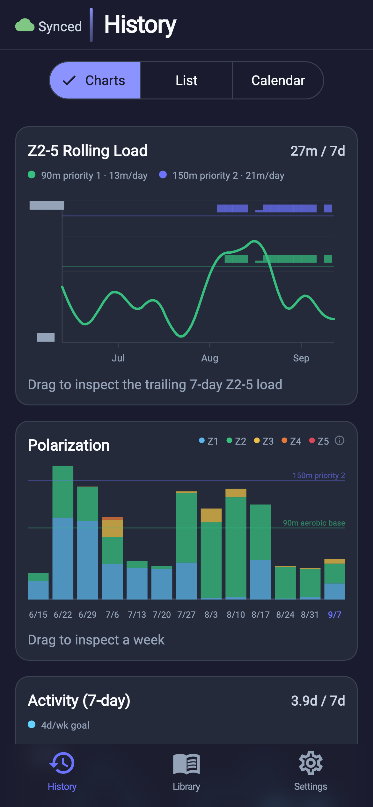
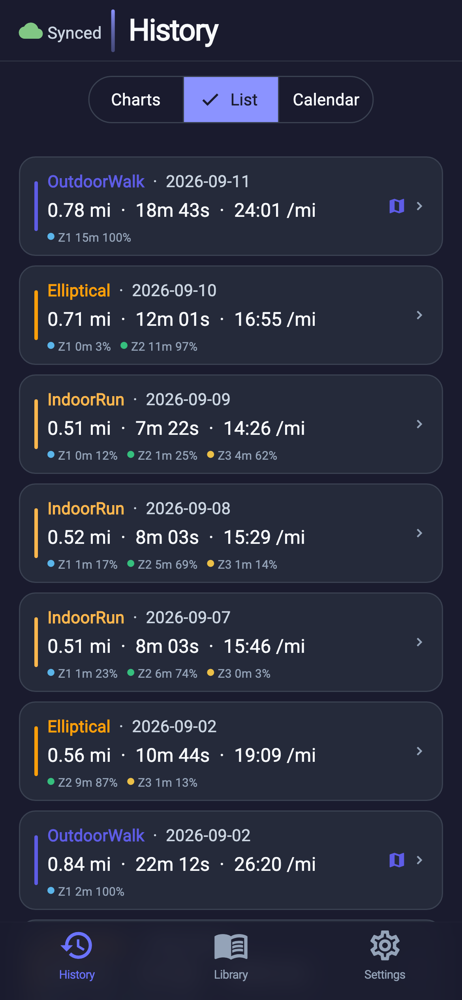
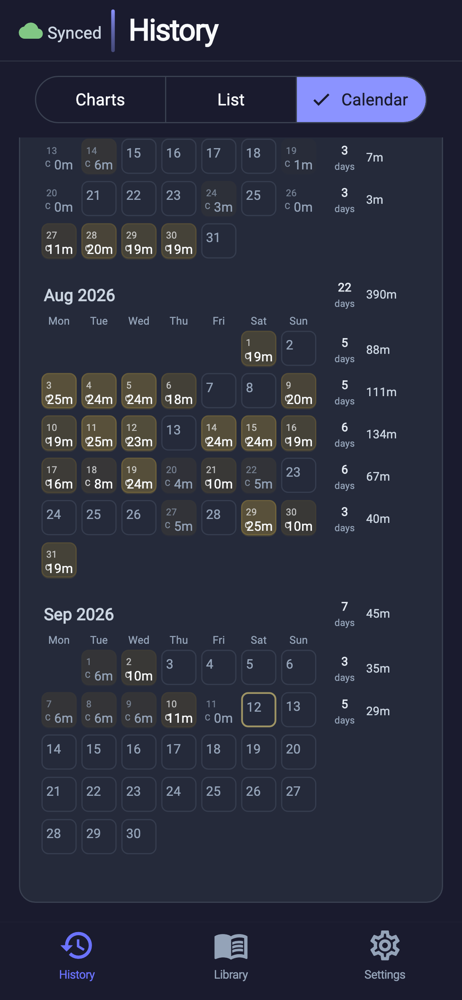

# Workouts

Personal workout tracker with local-first sync.

### Screenshots

## Stack

- **Flutter** with Material and ethan_ui
- **Riverpod** for state management
- **PowerSync** for local-first SQLite with real-time sync
- **Postgres** + **PostgREST** backend (managed in separate `infra` repo)
- **Docker compose** (also in separate `infra` repo)

## Setup

1. Copy `.env.example` to `.env` and fill in real values. Only `.env`
   is loaded at startup (see `main.dart`) and bundled as a Flutter asset.

2. Run `flutter pub get`

3. Run `flutter pub run build_runner build` (for Freezed/Riverpod codegen)

## Features

- **History**: Review past workout sessions and cardio
- **Library**: Heart-rate zones, workout templates, goals, and other training context
- **Settings**: Sync, Apple Health, and app configuration
